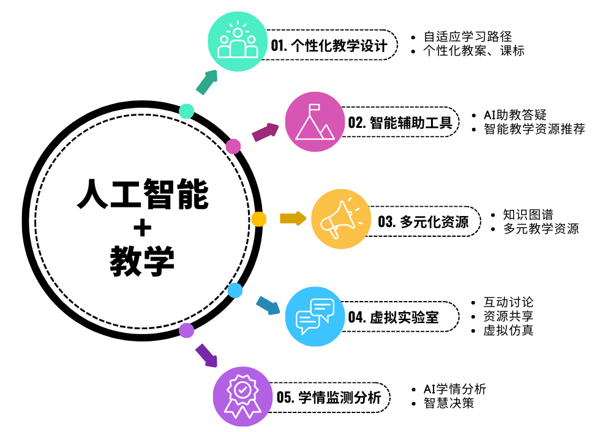
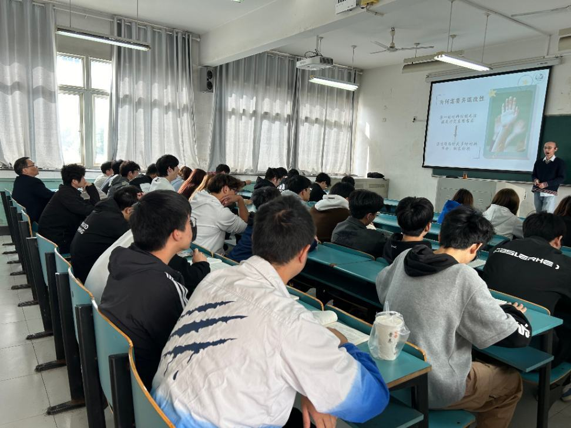
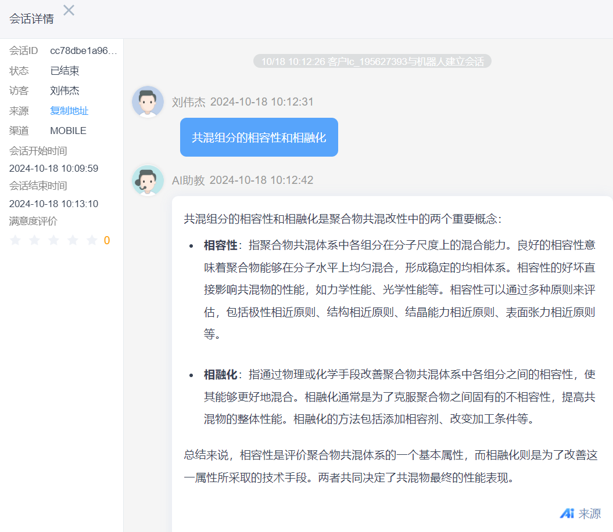
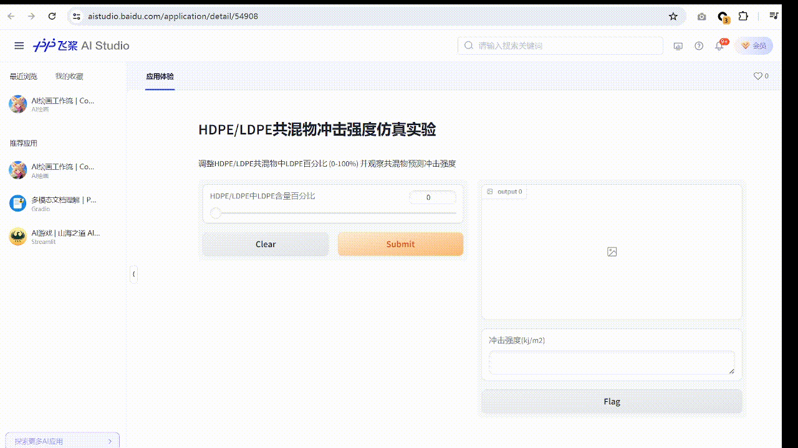
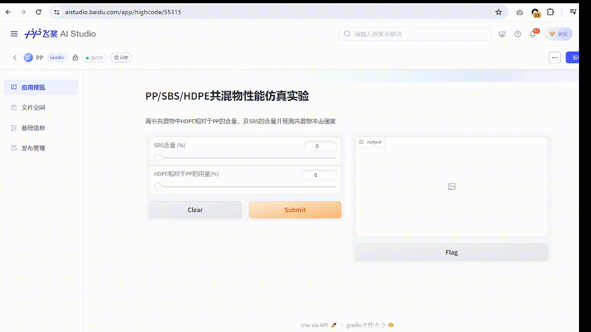
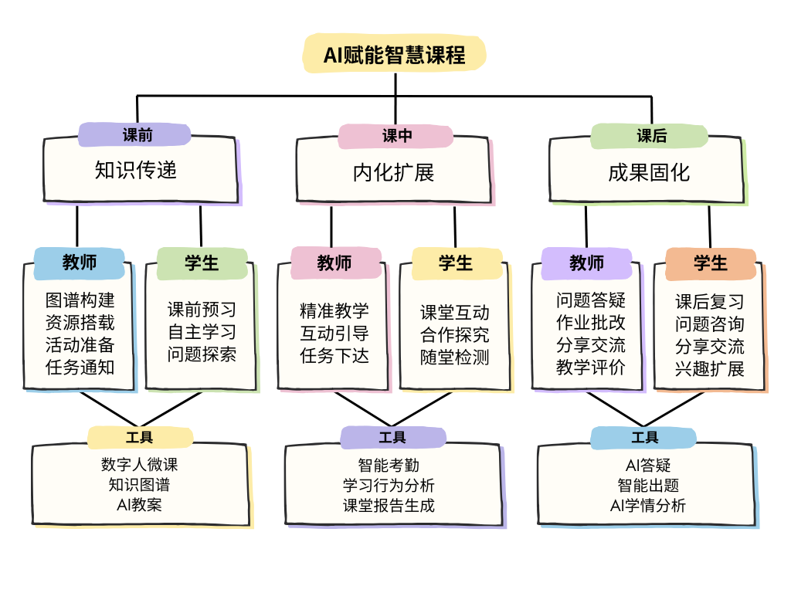

# 案例简介

>本案例从个性化教学、智能辅助工具、多元化资源、虚拟实验室及学情检测分析等方面入手，利用人工智能技术赋能课前、课中及课后教学。个性化定制方面，开发了自适应学习系统，提供个性化的学习路径和资源推荐。开发了虚拟仿真项目并将其融入知识图谱，提高了本课程的“两性一度”。有助于学生“能动脑”、“能动手”、“能动心”，促进学生渐进学习。本案例中制作的微课作品获得2024年第三届全国职业院校高分子材料类专业教师微课大赛一等奖；案例实施期间被认定为2024年校级公开课。

# 场景展示
## 课堂教学（结合仿真实验）

## AI助教对话

## 仿真应用展示
- HDPE-LDPE共混仿真实验

- PP-SBS-HDPE共混仿真实验

# 技术示意图

©CIIT aokaiz

